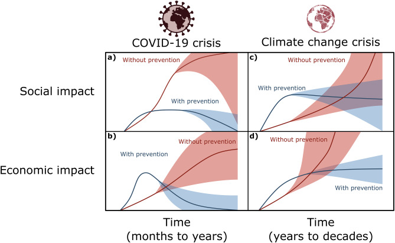

# The Psychology of Climate Anxiety

 
## Anxiety Around Climate Change

 

Current media and journalism is depicting the reality of the current state of the planet, inciting panic among the public.

 

**Climate Anxiety:** anxious feelings and worries about climate change regardless of whether the individual has been directly impacted (Schwartz et al., 2022).

 

### Climate anxiety ranges from… 

- **Feelings:** Apocalyptic fears to complex feelings around loss, grief, guilt (Dodds, 2021).

- **Response:** denial of reality (e.g., it is a conspiracy) to denial of loss (e.g., nature will suffer, but humans will be fine) (Dodds, 2021).

 

The causes of climate anxiety include individual experiences, media outlets, and education (Wolfe and Tubi, 2019). Greater information transmission is correlated with levels of climate anxiety (Maran and Begotti, 2021). Further, 73% of Canadian youth are frightened for the future due to fear of climate-related disasters (Galway and Field, 2023).

 

## Climate Anxiety: Motivating or Paralysing Global Response?

The effects of climate anxiety on global climate change response has been highly debated about whether it discourages or propagates climate action. An individual’s self-conceptualization influences potential response to climate change threats (Fritsche and Häfner, 2012).

- Environmentally conscious → tendency for pro-environmental conduct.

Human behavior is driven by the fear of death, leading to cultural beliefs and behaviors that mitigate this existential anxiety (Wolfe and Tubi, 2019).

- Fear of mortality → tendency for self-preservation, without regard for others and environment.

 

Low engagement in climate response may be due to displacement of responsibility, or eco-paralysis stemming from fear and anxiety (Stanley et al., 2021). Climate anxiety has also been associated with scepticism, which can cause conspiratorial thinking (Haltinner and Sarathchandra, 2018). An adaptive, moderate level of climate anxiety is a strong predictor of individual climate action (van Valkengoed and Steg, 2019).

 

## Learning from COVID-19

 

The COVID-19 pandemic shares many similarities with the climate crisis — they are both global issues with devastating societal and economic consequences.

 

*Figure 1: A visual representation of predicted social and economic impacts of the COVID-19 and climate crises. Curves are shown on different time scales with and without preventative measures. In all cases prevention has a higher cost, however, the cost goes down as measures are established. Without prevention, costs of dealing with the consequences of these crises are much higher than prevention (Manzanedo and Manning, 2020).*

 

### Similarities: COVID-19 & Climate Change:

 

- **Early prevention** → lower harms/death tolls (Figure 1) (Klenert et al., 2020).

- **Global inequity** → disproportionately affects vulnerable populations (Klenert et al., 2020).

 

**Cognitive dissonance:** the harbouring of thoughts contradictory to one's actions, preventing response (Burrows, Abellera and Markowitz, 2023).

Individuals ignored safety regulations put into place, potentially due to the limited tangible benefits to following these policies (McGrath, 2017). Blame is often placed on governments and the public, preventing individual response (Hinterleitner, Honegger and Sager, 2022). Individuals also blame others (e.g., political parties, countries) to protect one's ingroup (Bouguettaya, Walsh and Team, 2022). Both crises can cause individuals to adopt a zero-sum mentality; that the outgroup's gain comes at one’s own personal loss (Hasselmann et al., 2013).

### Differences: COVID-19 & Climate Change:

 

- **Temporal scales** → concerns are typically short-term versus long-term (Chen et al., 2020).

- **Degree of control over solutions** → immediate implementation of solutions to change personal outcomes versus long-term global cooperation to change a trend (Krampe et al., 2021).

 

The quantifiable threat of the pandemic reduced uncertainty and saw a more decisive public reaction.

 

## Further Implications

 

- Climate-related distress is often compounded by the perceived inaction of regulatory bodies (Hickman, 2020).

- A multi-step approach can be an effective solution, with both long-term and short-term applications to combat climate anxiety (Tam, Chan and Clayton, 2023).

- It is essential to harness climate anxiety as a catalyst for change that promotes a sense of agency and encourages action.

 

## References

Bouguettaya, A., Walsh, C.E.C. and Team, V., 2022. Social and Cognitive Psychology Theories in Understanding COVID-19 as the Pandemic of Blame. *Frontiers in Psychology*, [online] 12. Available at: <https://www.frontiersin.org/articles/10.3389/fpsyg.2021.672395> [Accessed 5 November 2023].

 

Burrows, B., Abellera, C. and Markowitz, E.M., 2023. COVID-19 and climate change: The social-psychological roots of conflict and conflict interventions during global crises. *WIREs Climate Change*, 14(5), p.e837. https://doi.org/10.1002/wcc.837.

 

Chen, S., Bagrodia, R., Pfeffer, C.C., Meli, L. and Bonanno, G.A., 2020. Anxiety and resilience in the face of natural disasters associated with climate change: A review and methodological critique. *Journal of Anxiety Disorders*, 76, p.102297. https://doi.org/10.1016/j.janxdis.2020.102297.

 

Dodds, J., 2021. The psychology of climate anxiety. *BJPsych Bulletin*, 45(4), pp.222–226. https://doi.org/10.1192/bjb.2021.18.

 

Fritsche, I. and Häfner, K., 2012. The Malicious Effects of Existential Threat on Motivation to Protect the Natural Environment and the Role of Environmental Identity as a Moderator. *Environment and Behavior*, 44(4), pp.570–590. https://doi.org/10.1177/0013916510397759.

 

Galway, L.P. and Field, E., 2023. Climate emotions and anxiety among young people in Canada: A national survey and call to action. *The Journal of Climate Change and Health*, 9, p.100204. https://doi.org/10.1016/j.joclim.2023.100204.

 

Haltinner, K. and Sarathchandra, D., 2018. Climate change skepticism as a psychological coping strategy. *Sociology Compass*, 12(6), p.e12586. https://doi.org/10.1111/soc4.12586.

 

Hasselmann, K., Jaeger, C., Leipold, G., Mangalagiu, D. and Tàbara, J.D., 2013. *Reframing the Problem of Climate Change: From Zero Sum Game to Win-Win Solutions.* Routledge.

 

Hickman, C., 2020. We need to (find a way to) talk about … Eco-anxiety. *Journal of Social Work Practice*, 34(4), pp.411–424. https://doi.org/10.1080/02650533.2020.1844166.

 

Hinterleitner, M., Honegger, C. and Sager, F., 2022. Blame avoidance in hard times: complex governance structures and the COVID-19 pandemic. *West European Politics*, 46(2), pp.324–346. https://doi.org/10.1080/01402382.2022.2064634.

 

Klenert, D., Funke, F., Mattauch, L. and O’Callaghan, B., 2020. Five Lessons from COVID-19 for Advancing Climate Change Mitigation. *Environmental and Resource Economics*, 76(4), pp.751–778. https://doi.org/10.1007/s10640-020-00453-w.

 

Krampe, H., Danbolt, L.J., Haver, A., Stålsett, G. and Schnell, T., 2021. Locus of control moderates the association of COVID-19 stress and general mental distress: results of a Norwegian and a German-speaking cross-sectional survey. *BMC Psychiatry*, 21(1), p.437. https://doi.org/10.1186/s12888-021-03418-5.

 

Manzanedo, R.D. and Manning, P., 2020. COVID-19: Lessons for the climate change emergency. *Science of The Total Environment*, 742, p.140563. https://doi.org/10.1016/j.scitotenv.2020.140563.

 

Maran, D.A. and Begotti, T., 2021. Media Exposure to Climate Change, Anxiety, and Efficacy Beliefs in a Sample of Italian University Students. *International Journal of Environmental Research and Public Health*, 18(17), p.9358. https://doi.org/10.3390/ijerph18179358.

 

McGrath, A., 2017. Dealing with dissonance: A review of cognitive dissonance reduction. *Social and Personality Psychology Compass*, 11(12), p.e12362. https://doi.org/10.1111/spc3.12362.

 

Schwartz, S.E.O., Benoit, L., Clayton, S., Parnes, M.F., Swenson, L. and Lowe, S.R., 2022. Climate change anxiety and mental health: Environmental activism as buffer. *Current Psychology* (New Brunswick, N.j.), pp.1–14. https://doi.org/10.1007/s12144-022-02735-6.

 

Stanley, S.K., Hogg, T.L., Leviston, Z. and Walker, I., 2021. From anger to action: Differential impacts of eco-anxiety, eco-depression, and eco-anger on climate action and wellbeing. *The Journal of Climate Change and Health*, 1, p.100003. https://doi.org/10.1016/j.joclim.2021.100003.

 

Tam, K.-P., Chan, H.-W. and Clayton, S., 2023. Climate change anxiety in China, India, Japan, and the United States. *Journal of Environmental Psychology*, 87, p.101991. https://doi.org/10.1016/j.jenvp.2023.101991.

 

van Valkengoed, A.M. and Steg, L., 2019. Meta-analyses of factors motivating climate change adaptation behaviour. *Nature Climate Change*, 9(2), pp.158–163. https://doi.org/10.1038/s41558-018-0371-y.

 

Wolfe, S.E. and Tubi, A., 2019. Terror Management Theory and mortality awareness: A missing link in climate response studies? *WIREs Climate Change*, 10(2), p.e566. https://doi.org/10.1002/wcc.566.

